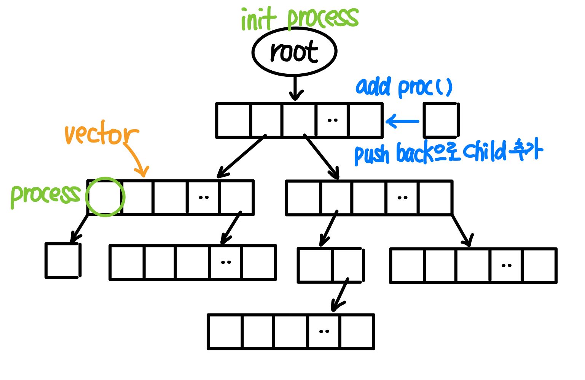
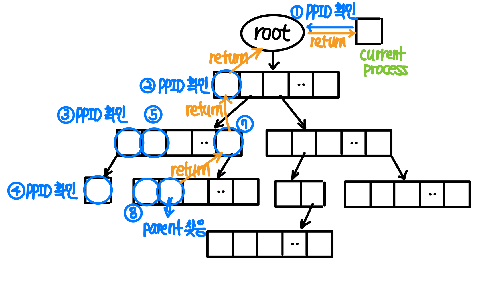
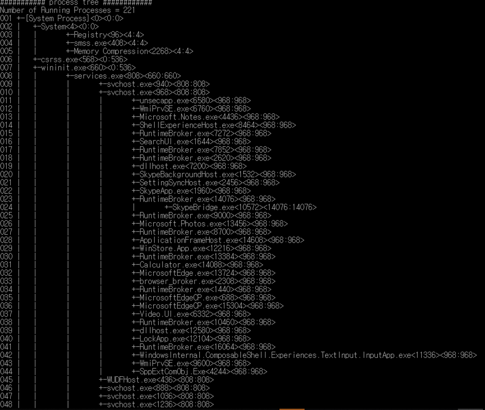

# process-tree
> 모든 프로세스들을 tree 형태로 출력하는 프로그램

## Project Stack

* C++

## Project Description

### 전체적인 구상도

#### parent process를 찾는 과정

Process를 print 할 때에도 동일한 방식으로 print

 

### Flow Chart

### 실행 결과

